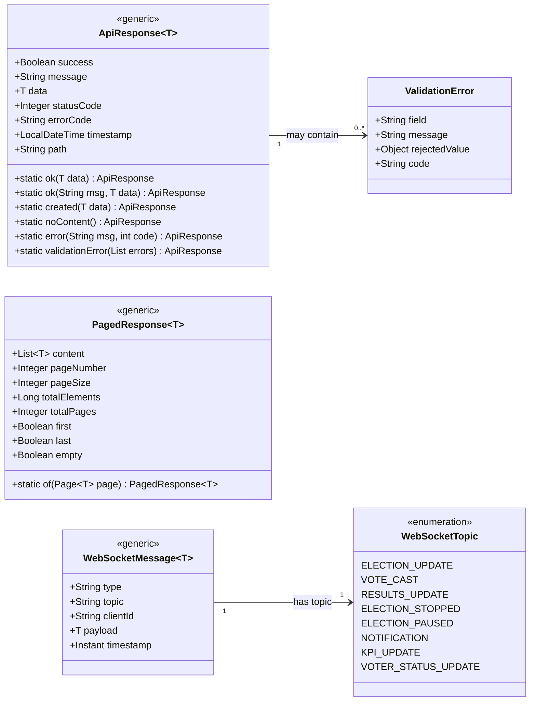
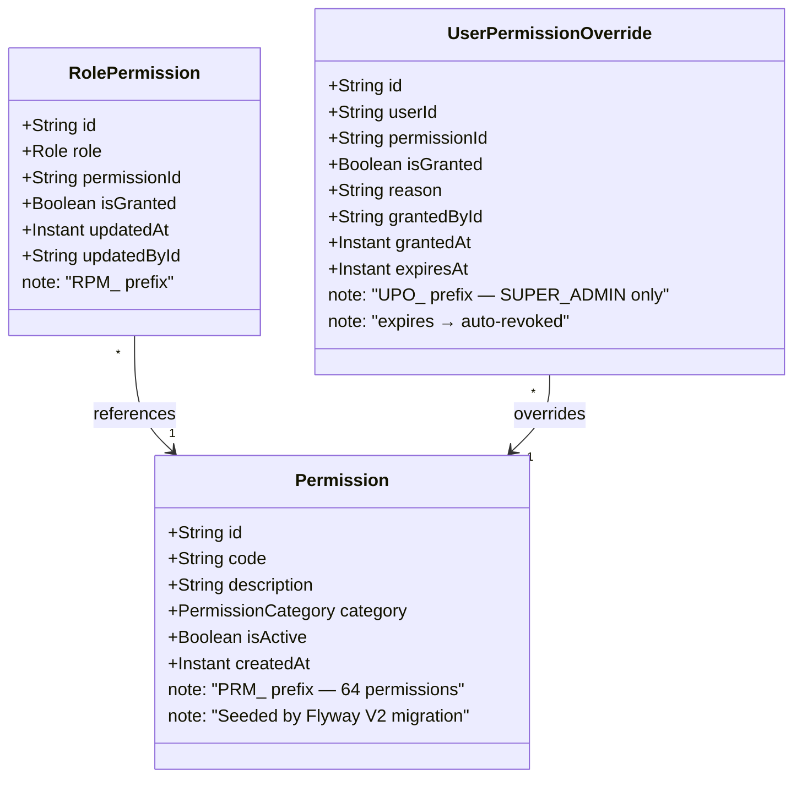

# VotCam — Complete Class Diagram (Updated)
> Version: 2.0.0 | Integrates: Audit per service · Prefixed IDs · Bootstrap · Anonymous votes · Live results

---

## 🆔 ID Format Convention

Every entity uses a **String ID** with a fixed prefix + UUID (no auto-increment).

| Entity | Prefix | Example |
|--------|--------|---------|
| User | `USR_` | `USR_a1b2c3d4-e5f6-...` |
| Client | `CLT_` | `CLT_a1b2c3d4-e5f6-...` |
| Plan | `PLN_` | `PLN_a1b2c3d4-...` |
| ClientPlan | `CPL_` | `CPL_a1b2c3d4-...` |
| ApiKey | `APK_` | `APK_a1b2c3d4-...` |
| Permission | `PRM_` | `PRM_a1b2c3d4-...` |
| RolePermission | `RPM_` | `RPM_a1b2c3d4-...` |
| UserPermissionOverride | `UPO_` | `UPO_a1b2c3d4-...` |
| RefreshToken | `RTK_` | `RTK_a1b2c3d4-...` |
| OtpCode | `OTP_` | `OTP_a1b2c3d4-...` |
| BlacklistedToken | `BTK_` | `BTK_a1b2c3d4-...` |
| SystemSetup | `SYS_` | `SYS_a1b2c3d4-...` |
| Address | `ADR_` | `ADR_a1b2c3d4-...` |
| Election | `ELC_` | `ELC_a1b2c3d4-...` |
| Candidate | `CND_` | `CND_a1b2c3d4-...` |
| Vote | `VTE_` | `VTE_a1b2c3d4-...` |
| VoteChoice | `VCH_` | `VCH_a1b2c3d4-...` |
| ElectionVoter | `ELV_` | `ELV_a1b2c3d4-...` |
| ElectionManager | `ELM_` | `ELM_a1b2c3d4-...` |
| QRCode | `QRC_` | `QRC_a1b2c3d4-...` |
| ElectionResult | `ELR_` | `ELR_a1b2c3d4-...` |
| Webhook | `WBH_` | `WBH_a1b2c3d4-...` |
| WebhookDelivery | `WDL_` | `WDL_a1b2c3d4-...` |
| AuditLog (all) | `AUD_` | `AUD_a1b2c3d4-...` |
| Notification | `NTF_` | `NTF_a1b2c3d4-...` |
| EmailTemplate | `EMT_` | `EMT_a1b2c3d4-...` |
| SystemKpi | `SKP_` | `SKP_a1b2c3d4-...` |
| ClientKpi | `CKP_` | `CKP_a1b2c3d4-...` |

### Java Generator Pattern (shared by all services)
```java
// EntityIdGenerator.java — used in all @PrePersist
public static String generate(String prefix) {
    return prefix + UUID.randomUUID().toString();
}
// Usage: @PrePersist → this.id = EntityIdGenerator.generate("USR_");
```

---

## 🔐 System Bootstrap / Initialization

```
Problem: How does the first SUPER_ADMIN register securely?

Solution: Bootstrap Endpoint (disabled after first use)

Flow:
  1. Frontend checks GET /api/v1/system/init/status
     → { "initialized": false } → redirect to /bootstrap page
     → { "initialized": true  } → redirect to /login

  2. Admin calls POST /api/v1/system/init/bootstrap
     Header: X-Bootstrap-Secret: <value from .env>
     Body: { firstName, lastName, email, password }
     → System checks: no SUPER_ADMIN exists + valid secret
     → Creates SUPER_ADMIN with status PENDING_VERIFICATION
     → Sends OTP to email
     → Returns: { "message": "OTP sent to email" }

  3. Admin verifies OTP → POST /api/v1/system/init/verify
     Body: { email, otpCode }
     → SUPER_ADMIN status → ACTIVE
     → SystemSetup.isInitialized = true (endpoint now disabled forever)
     → Returns JWT access_token + refresh_token

  4. All subsequent calls to /bootstrap return 403 FORBIDDEN
```

---

## 🗃️ SERVICE 1 — Auth Service

```mermaid
classDiagram
    direction TB

    %% ─── ENUMERATIONS ────────────────────────────────────────────────
    class OtpType {
        <<enumeration>>
        EMAIL_VERIFICATION
        PASSWORD_RESET
        TWO_FACTOR_LOGIN
        VOTE_CONFIRMATION
    }

    %% ─── ENTITIES ────────────────────────────────────────────────────
    class SystemSetup {
        +String id
        +Boolean isInitialized
        +String superAdminEmail
        +String bootstrapIpAddress
        +String bootstrapUserAgent
        +Integer failedBootstrapAttempts
        +Instant initializedAt
        +Instant createdAt
        note: "SYS_ prefix — singleton row"
        note: "isInitialized=true disables bootstrap endpoint forever"
    }

    class RefreshToken {
        +String id
        +String token
        +String userId
        +String userEmail
        +Boolean revoked
        +String revokedReason
        +Instant expiresAt
        +Instant createdAt
        note: "RTK_ prefix"
    }

    class OtpCode {
        +String id
        +String code
        +String userId
        +String userEmail
        +OtpType type
        +Boolean used
        +Integer attemptCount
        +Instant expiresAt
        +Instant usedAt
        +Instant createdAt
        note: "OTP_ prefix"
        note: "Expires after 10 min — 6 digits"
    }

    class BlacklistedToken {
        +String id
        +String tokenHash
        +String userId
        +String reason
        +Instant blacklistedAt
        +Instant originalExpiresAt
        note: "BTK_ prefix"
        note: "tokenHash = SHA256(rawToken)"
    }

    class AuthAuditLog {
        +String id
        +String userId
        +String userEmail
        +String action
        +String ipAddress
        +String userAgent
        +Boolean success
        +String failureReason
        +String details
        +Instant performedAt
        note: "AUD_ prefix"
        note: "Tracks: LOGIN, LOGOUT, OTP_REQUEST"
        note: "OTP_VERIFY, PASSWORD_RESET, BOOTSTRAP"
        note: "TOKEN_REFRESH, TOKEN_REVOKE, FAILED_LOGIN"
        note: "ADDRESS_CREATE, ADDRESS_UPDATE"
    }

    class Address {
        +String id
        +String userId
        +String street
        +String city
        +String region
        +String postalCode
        +String country
        +String countryCode
        +Boolean isPrimary
        +Instant createdAt
        +Instant updatedAt
        note: "ADR_ prefix"
        note: "Filled by user DURING registration"
        note: "userId → references User.id in user-service"
        note: "One user can have multiple addresses"
        note: "isPrimary=true → default/billing address"
        note: "On update: old address kept for audit trail"
    }

    class JwtClaims {
        <<value object>>
        +String sub
        +String email
        +String role
        +String clientId
        +String clientSlug
        +List~String~ permissions
        +String preferredLanguage
        +Long iat
        +Long exp
        note: "Embedded in JWT access token"
        note: "permissions loaded from user-service at login"
        note: "permissions RELOADED on every token refresh"
        note: "avoids calling user-service on each request"
        note: "Example: ['ELECTION_CREATE','VOTER_INVITE',...]"
    }

    OtpCode "1"  --> "1" OtpType : has type
    Address "*"  ..> "1" RefreshToken : same userId
    Address "1"  --> "1" Address : isPrimary flag
```



---

## 🗃️ SERVICE 2 — User Service

```mermaid
classDiagram
    direction TB

    %% ─── ENUMERATIONS ────────────────────────────────────────────────
    class Role {
        <<enumeration>>
        SUPER_ADMIN
        CLIENT_ADMIN
        ELECTION_MANAGER
        SCRUTINEER
        VOTER
    }

    class UserStatus {
        <<enumeration>>
        ACTIVE
        INACTIVE
        SUSPENDED
        PENDING_VERIFICATION
    }

    class Language {
        <<enumeration>>
        EN
        FR
    }

    class ClientStatus {
        <<enumeration>>
        ACTIVE
        SUSPENDED
        TRIAL
        EXPIRED
    }

    class PlanType {
        <<enumeration>>
        FREE
        STARTER
        PRO
        ENTERPRISE
    }

    class ApiKeyStatus {
        <<enumeration>>
        ACTIVE
        REVOKED
        EXPIRED
    }

    class ApiPermission {
        <<enumeration>>
        READ_ELECTIONS
        MANAGE_ELECTIONS
        READ_VOTERS
        MANAGE_VOTERS
        READ_RESULTS
        CAST_VOTE
        MANAGE_WEBHOOKS
        MANAGE_CANDIDATES
    }

    class PermissionCategory {
        <<enumeration>>
        ELECTION
        CANDIDATE
        VOTER
        VOTE
        RESULTS
        USER
        CLIENT
        PLAN
        API_KEY
        WEBHOOK
        QR_CODE
        ANALYTICS
        AUDIT
        IMPORT_EXPORT
        NOTIFICATION
        SYSTEM
    }

    %% ─── PERMISSION SYSTEM ───────────────────────────────────────────
    class Permission {
        +String id
        +String code
        +String description
        +PermissionCategory category
        +Boolean isActive
        +Instant createdAt
        note: "PRM_ prefix — 64 permissions seeded by Flyway"
    }

    class RolePermission {
        +String id
        +Role role
        +String permissionId
        +Boolean isGranted
        +Instant updatedAt
        +String updatedById
        note: "RPM_ prefix"
        note: "Cached in Redis 1h per role"
    }

    class UserPermissionOverride {
        +String id
        +String userId
        +String permissionId
        +Boolean isGranted
        +String reason
        +String grantedById
        +Instant grantedAt
        +Instant expiresAt
        note: "UPO_ prefix — SUPER_ADMIN only"
        note: "Cached in Redis 30min per user"
    }

    %% ─── CORE ENTITIES ───────────────────────────────────────────────
    class User {
        +String id
        +String firstName
        +String lastName
        +String email
        +String password
        +String phoneNumber
        +String avatarPath
        +String avatarUrl
        +Role role
        +String clientId
        +Language preferredLanguage
        +UserStatus status
        +Boolean emailVerified
        +Instant lastLoginAt
        +String lastLoginIp
        +Instant createdAt
        +Instant updatedAt
        +String createdById
        note: "USR_ prefix"
        note: "avatarPath = /uploads/avatars/USR_xxx.jpg"
        note: "avatarUrl = served via /files/avatars/USR_xxx.jpg"
    }

    class Client {
        +String id
        +String name
        +String slug
        +String email
        +String phone
        +String address
        +String country
        +String logoPath
        +String logoUrl
        +String primaryColor
        +String secondaryColor
        +ClientStatus status
        +PlanType currentPlan
        +Language defaultLanguage
        +Boolean whiteLabel
        +String customDomain
        +String websiteUrl
        +String description
        +Instant trialEndsAt
        +Instant createdAt
        +Instant updatedAt
        +String createdById
        note: "CLT_ prefix"
        note: "logoPath = /uploads/logos/CLT_xxx.png"
        note: "logoUrl = /files/logos/CLT_xxx.png"
        note: "Logo updatable via PATCH /clients/{id}/logo"
    }

    class Plan {
        +String id
        +PlanType planType
        +String name
        +String description
        +Double priceXAF
        +Double priceUSD
        +Double priceEUR
        +Integer maxConcurrentElections
        +Integer maxVotersPerElection
        +Integer maxCandidatesPerElection
        +Integer maxElectionManagers
        +Integer maxClientAdmins
        +Integer maxElectionDurationDays
        +Boolean qrCodePerVoter
        +Boolean csvExport
        +Boolean pdfExport
        +Boolean apiAccess
        +Boolean webhooks
        +Boolean whiteLabel
        +Boolean advancedAnalytics
        +Integer auditLogRetentionDays
        +Boolean isActive
        +Instant createdAt
        note: "PLN_ prefix"
    }

    class ClientPlan {
        +String id
        +String clientId
        +String planId
        +PlanType planType
        +Instant startDate
        +Instant endDate
        +Boolean isActive
        +String activatedByEmail
        +String notes
        +Instant createdAt
        note: "CPL_ prefix"
    }

    class ApiKey {
        +String id
        +String clientId
        +String name
        +String apiKeyHash
        +String secretKeyHash
        +String apiKeyPrefix
        +ApiKeyStatus status
        +List~ApiPermission~ permissions
        +String ipWhitelist
        +Instant lastUsedAt
        +Instant expiresAt
        +Instant createdAt
        +String createdById
        note: "APK_ prefix"
        note: "apiKeyPrefix shown to user (e.g. ak_abc12)"
        note: "Full key shown only once on creation"
    }

    class UserAuditLog {
        +String id
        +String userId
        +String userEmail
        +String clientId
        +String clientName
        +String action
        +String entity
        +String entityId
        +String entityName
        +String oldValue
        +String newValue
        +String ipAddress
        +String userAgent
        +Boolean success
        +String failureReason
        +Instant performedAt
        note: "AUD_ prefix"
        note: "Tracks: USER_CREATE, USER_UPDATE, USER_DELETE"
        note: "USER_SUSPEND, USER_RESTORE, CLIENT_CREATE"
        note: "CLIENT_UPDATE, PLAN_ASSIGN, API_KEY_CREATE"
        note: "API_KEY_REVOKE, PERMISSION_CHANGE, LOGO_UPDATE"
        note: "AVATAR_UPDATE"
    }

    %% ─── RELATIONSHIPS ────────────────────────────────────────────────
    User "1"  --> "1" Role                    : has role
    User "1"  --> "1" Language                : prefers
    User "1"  --> "1" UserStatus              : has status
    User "*"  --> "1" Client                  : belongs to
    User "1"  --> "*" UserPermissionOverride  : has overrides

    RolePermission         "*" --> "1" Permission : maps to
    UserPermissionOverride "*" --> "1" Permission : overrides
    RolePermission         "1" --> "1" Role       : for role

    Client     "1" --> "1" ClientStatus : has status
    Client     "1" --> "1" PlanType     : current plan
    Client     "1" --> "1" Language     : default language
    Client     "1" --> "*" ApiKey       : owns
    Client     "1" --> "*" User         : has users

    Plan       "1" --> "1" PlanType  : type
    ClientPlan "*" --> "1" Client    : subscribes
    ClientPlan "*" --> "1" Plan      : uses
    ApiKey     "*" --> "1" Client    : belongs to
    ApiKey     "1" --> "1" ApiKeyStatus : has status
    Permission "1" --> "1" PermissionCategory : belongs to
```

---

## 🗃️ SERVICE 3 — Vote Service

### 🔒 Vote Anonymity Architecture

```
PROBLEM: System must know WHO voted (prevent double vote)
         But must NOT know WHAT they voted for (anonymity)

SOLUTION: Two-layer hashing with salt

  Step 1 → Voter authenticates + system verifies not yet voted
  Step 2 → System generates:
           salt       = SecureRandom.generateSecure(32 bytes)
           receipt    = HMAC-SHA256(SERVER_VOTE_SECRET, userId + electionId + timestamp + salt)

  Step 3 → ElectionVoter updated:
           hasVoted       = true
           voteReceiptHash = receipt          ← voter's proof of participation
           votedAt        = now()
           (salt discarded after this step)

  Step 4 → Vote created:
           ballotToken    = SHA256(receipt)   ← 2nd hash, NOT the receipt itself
           voterId        = NOT STORED        ← anonymity guaranteed
           choices stored in VoteChoice table

  Step 5 → Voter receives their receipt as confirmation email
           They can verify: "My receipt is in the system" → yes
           Admin cannot query: "Who cast vote VTE_xxx?" → impossible

  GUARANTEE:
    ElectionVoter.voteReceiptHash ≠ Vote.ballotToken
    (one is SHA256 of the other, salt is gone)
    Even with full DB access, linking voter → vote is computationally infeasible
```

```mermaid
classDiagram
    direction TB

    %% ─── ENUMERATIONS ────────────────────────────────────────────────
    class ElectionVoteType {
        <<enumeration>>
        SIMPLE
        MULTIPLE
        WEIGHTED
    }

    class ElectionStatus {
        <<enumeration>>
        DRAFT
        PUBLISHED
        ACTIVE
        PAUSED
        STOPPED
        CLOSED
        CANCELLED
        ARCHIVED
    }

    class BallotSecrecy {
        <<enumeration>>
        PUBLIC
        SECRET
    }

    class VoteStatus {
        <<enumeration>>
        PENDING
        CONFIRMED
        INVALIDATED
    }

    class ElectionVoterStatus {
        <<enumeration>>
        INVITED
        REGISTERED
        VOTED
        ABSTAINED
        DISQUALIFIED
    }

    class ManagerRole {
        <<enumeration>>
        MANAGER
        SCRUTINEER
    }

    class QRCodeType {
        <<enumeration>>
        ELECTION
        VOTER
    }

    class WebhookEvent {
        <<enumeration>>
        ELECTION_CREATED
        ELECTION_PUBLISHED
        ELECTION_STARTED
        ELECTION_PAUSED
        ELECTION_STOPPED
        ELECTION_CLOSED
        VOTE_CAST
        VOTER_INVITED
        VOTER_DISQUALIFIED
        RESULTS_PUBLISHED
    }

    class NotificationType {
        <<enumeration>>
        ELECTION_INVITATION
        ELECTION_STARTED
        ELECTION_PAUSED
        ELECTION_STOPPED
        VOTE_CONFIRMED
        RESULTS_AVAILABLE
        ACCOUNT_VERIFIED
        PASSWORD_RESET
        PLAN_UPGRADED
        PLAN_EXPIRED
        API_KEY_CREATED
        API_KEY_REVOKED
        ELECTION_LIMIT_WARNING
    }

    class AuditAction {
        <<enumeration>>
        CREATE
        UPDATE
        DELETE
        LOGIN
        LOGOUT
        VOTE_CAST
        EXPORT
        IMPORT
        API_ACCESS
        PLAN_CHANGE
        SUSPEND
        RESTORE
        PUBLISH
        START
        PAUSE
        STOP
        ARCHIVE
        QR_GENERATE
        RESULT_COMPUTE
        WEBHOOK_TRIGGER
    }

    %% ─── CORE ENTITIES ───────────────────────────────────────────────
    class Election {
        +String id
        +String clientId
        +String createdById
        +String title
        +String titleFr
        +String description
        +String descriptionFr
        +ElectionVoteType voteType
        +ElectionStatus status
        +BallotSecrecy ballotSecrecy
        +Integer maxChoicesPerVoter
        +Instant startDate
        +Instant endDate
        +Boolean isPublic
        +String accessCode
        +Boolean requireOtpToVote
        +Boolean showLiveResults
        +Boolean allowResultsAfterClose
        +String bannerPath
        +String bannerUrl
        +Instant stoppedAt
        +String stoppedById
        +String stopReason
        +Instant createdAt
        +Instant updatedAt
        note: "ELC_ prefix"
        note: "bannerPath = /uploads/banners/ELC_xxx.jpg"
    }

    class Candidate {
        +String id
        +String electionId
        +String linkedUserId
        +String firstName
        +String lastName
        +String displayName
        +String description
        +String descriptionFr
        +String photoPath
        +String photoUrl
        +String party
        +String program
        +Integer position
        +Boolean isActive
        +Instant createdAt
        +Instant updatedAt
        note: "CND_ prefix"
        note: "linkedUserId is OPTIONAL"
        note: "CONSTRAINT: linkedUserId must NOT exist"
        note: "in ElectionVoter for same electionId"
        note: "photoPath = /uploads/photos/CND_xxx.jpg"
        note: "A candidate CANNOT cast a vote in their own election"
    }

    class Vote {
        +String id
        +String electionId
        +String ballotToken
        +VoteStatus status
        +String ipAddress
        +String deviceInfo
        +Boolean isValid
        +String invalidReason
        +Instant castedAt
        +Instant confirmedAt
        note: "VTE_ prefix"
        note: "NO voterId field — anonymity guaranteed"
        note: "ballotToken = SHA256(voteReceiptHash)"
        note: "voteReceiptHash stored only in ElectionVoter"
        note: "Linking voter→vote is computationally infeasible"
    }

    class VoteChoice {
        +String id
        +String voteId
        +String candidateId
        +Integer weight
        +Integer rank
        note: "VCH_ prefix"
        note: "weight used for WEIGHTED vote type"
        note: "rank used for preference ordering"
    }

    class ElectionVoter {
        +String id
        +String electionId
        +String userId
        +String userEmail
        +ElectionVoterStatus status
        +Boolean hasVoted
        +String voteReceiptHash
        +Instant votedAt
        +Instant invitedAt
        +Instant registeredAt
        +String invitationToken
        +Boolean tokenUsed
        note: "ELV_ prefix"
        note: "voteReceiptHash = HMAC(secret, userId+electionId+ts+salt)"
        note: "Voter receives this as email receipt"
        note: "CONSTRAINT: userId must NOT be a Candidate.linkedUserId"
        note: "in the same election"
        note: "userId ≠ any Candidate.linkedUserId for this electionId"
    }

    class ElectionManager {
        +String id
        +String electionId
        +String userId
        +String userEmail
        +ManagerRole managerRole
        +Instant assignedAt
        +String assignedById
        note: "ELM_ prefix"
    }

    class QRCode {
        +String id
        +String electionId
        +String voterId
        +String token
        +QRCodeType type
        +String qrImagePath
        +String qrImageUrl
        +Boolean isUsed
        +Integer scanCount
        +Instant usedAt
        +Instant expiresAt
        +Instant createdAt
        note: "QRC_ prefix"
        note: "type=ELECTION → shared QR for all voters"
        note: "type=VOTER → personal QR per voter (sent by email)"
        note: "qrImagePath = /uploads/qrcodes/QRC_xxx.png"
    }

    class ElectionResult {
        +String id
        +String electionId
        +String candidateId
        +Integer totalVotes
        +Double percentage
        +Integer rank
        +Integer totalWeightedScore
        +Boolean isFinal
        +Instant computedAt
        note: "ELR_ prefix"
        note: "Updated after EVERY vote (live results)"
        note: "Triggers WebSocket broadcast on each update"
    }

    class Webhook {
        +String id
        +String clientId
        +String name
        +String url
        +String secretKey
        +List~WebhookEvent~ subscribedEvents
        +Boolean isActive
        +Integer maxRetries
        +Integer timeoutSeconds
        +Instant createdAt
        +Instant updatedAt
        note: "WBH_ prefix"
    }

    class WebhookDelivery {
        +String id
        +String webhookId
        +WebhookEvent event
        +String payload
        +Integer httpStatusCode
        +Boolean success
        +Integer attemptNumber
        +String errorMessage
        +Instant nextRetryAt
        +Instant deliveredAt
        +Instant createdAt
        note: "WDL_ prefix"
    }

    class VoteAuditLog {
        +String id
        +String userId
        +String userEmail
        +String clientId
        +String clientName
        +AuditAction action
        +String entity
        +String entityId
        +String entityName
        +String oldValue
        +String newValue
        +String ipAddress
        +String userAgent
        +Boolean success
        +String failureReason
        +Instant performedAt
        note: "AUD_ prefix"
        note: "Vote actions logged WITHOUT candidateId"
        note: "Only: VOTE_CAST confirmed for userId in electionId"
        note: "Never logs WHAT was voted — only THAT a vote was cast"
    }

    class Notification {
        +String id
        +String userId
        +String userEmail
        +String clientId
        +NotificationType type
        +String title
        +String titleFr
        +String message
        +String messageFr
        +String relatedEntityId
        +String relatedEntityType
        +Boolean isRead
        +Boolean emailSent
        +Instant readAt
        +Instant createdAt
        note: "NTF_ prefix"
    }

    class EmailTemplate {
        +String id
        +String templateCode
        +String serviceName
        +Language language
        +String subject
        +String htmlBody
        +String textBody
        +Boolean isActive
        +Instant createdAt
        +Instant updatedAt
        note: "EMT_ prefix"
        note: "Stored in DB — updatable by SUPER_ADMIN"
        note: "language: EN or FR"
    }

    class SystemKpi {
        +String id
        +Integer totalClients
        +Integer activeClients
        +Integer totalElections
        +Integer activeElections
        +Long totalVotesCast
        +Integer totalUsers
        +Integer totalVoters
        +Integer totalApiKeys
        +Integer totalWebhooks
        +Double avgParticipationRate
        +Instant computedAt
        note: "SKP_ prefix"
        note: "Pushed via WebSocket /topic/admin/kpi"
        note: "after every significant system event"
    }

    class ClientKpi {
        +String id
        +String clientId
        +Integer totalElections
        +Integer activeElections
        +Integer completedElections
        +Long totalVotesCast
        +Integer totalVoters
        +Integer totalManagers
        +Integer totalCandidates
        +Double avgParticipationRate
        +Integer totalApiCalls
        +Instant computedAt
        note: "CKP_ prefix"
        note: "Pushed via WebSocket /topic/client/{id}/kpi"
        note: "after every vote cast for that client"
    }

    %% ─── RELATIONSHIPS ────────────────────────────────────────────────
    Election "1" --> "1" ElectionVoteType  : vote type
    Election "1" --> "1" ElectionStatus    : status
    Election "1" --> "1" BallotSecrecy     : secrecy
    Election "1" --> "*" Candidate         : has candidates
    Election "1" --> "*" ElectionVoter     : has voters
    Election "1" --> "*" ElectionManager   : has managers
    Election "1" --> "*" QRCode            : has QR codes
    Election "1" --> "*" ElectionResult    : produces results
    Election "1" --> "*" Vote              : receives votes

    Vote    "1" --> "1" VoteStatus  : has status
    Vote    "1" --> "*" VoteChoice  : has choices
    VoteChoice "*" --> "1" Candidate : selects

    ElectionVoter   "1" --> "1" ElectionVoterStatus : status
    ElectionManager "1" --> "1" ManagerRole          : role
    QRCode          "1" --> "1" QRCodeType            : type

    Webhook         "1" --> "*" WebhookDelivery : deliveries
    ElectionResult  "*" --> "1" Candidate       : for candidate
    Notification    "1" --> "1" NotificationType : type
    VoteAuditLog    "1" --> "1" AuditAction      : action

    ClientKpi "*" ..> "1" Election  : aggregates
    SystemKpi "1" ..> "*" ClientKpi : aggregates
```

---

## 📡 Live Results Flow (Real-time)

```
Voter casts vote
       │
       ▼
VoteService.castVote()
       │
       ├─ 1. Verify voter is assigned to election (ElectionVoter)
       ├─ 2. Verify voter has NOT voted (hasVoted = false)
       ├─ 3. Verify election status = ACTIVE
       ├─ 4. Verify voter is NOT a Candidate in this election
       │
       ├─ 5. Generate: salt + voteReceiptHash (HMAC)
       ├─ 6. Create Vote { ballotToken=SHA256(receipt), NO voterId }
       ├─ 7. Create VoteChoice records
       ├─ 8. Update ElectionVoter { hasVoted=true, voteReceiptHash }
       │
       ├─ 9. Update ElectionResult (increment counts + percentages)
       │
       ├─ 10. WebSocketEventPublisher.broadcastResults(electionId)
       │        → SimpMessagingTemplate.convertAndSend(
       │            "/topic/election/{id}/results",
       │            ElectionResultPayload { candidates, totals, percentages }
       │          )
       │
       ├─ 11. WebSocketEventPublisher.broadcastKpi(clientId)
       │        → SimpMessagingTemplate.convertAndSend(
       │            "/topic/client/{clientId}/kpi",
       │            ClientKpiPayload { totalVotes, participation }
       │          )
       │
       ├─ 12. VoteAuditLog { action=VOTE_CAST, userId, electionId }
       │       (NO candidate info logged — anonymity)
       │
       ├─ 13. Send VOTE_CONFIRMED notification + email (with receipt)
       │
       └─ 14. Trigger VOTE_CAST webhook for client's subscribed webhooks

Angular client (subscribed to /topic/election/{id}/results):
  → onMessage(payload) → update ApexCharts in real-time
  → No page refresh needed (RxJS Observable)
```

---

## 🗂️ SHARED — Common DTOs (All Services)



---

## 🔐 Permission System



---

## 🔗 Audit Coverage per Service

| Service | Audit Entity | Tracked Actions |
|---------|-------------|-----------------|
| **auth-service** | `AuthAuditLog` | LOGIN, LOGOUT, OTP_REQUEST, OTP_VERIFY, PASSWORD_RESET, BOOTSTRAP, TOKEN_REFRESH, TOKEN_REVOKE, FAILED_LOGIN |
| **user-service** | `UserAuditLog` | USER_CREATE/UPDATE/DELETE/SUSPEND/RESTORE, CLIENT_CREATE/UPDATE, PLAN_ASSIGN, API_KEY_CREATE/REVOKE, PERMISSION_CHANGE, LOGO_UPDATE, AVATAR_UPDATE |
| **vote-service** | `VoteAuditLog` | ELECTION lifecycle (CREATE→ARCHIVE), VOTE_CAST (no candidate info), CANDIDATE CRUD, VOTER management, QR_GENERATE, RESULT_COMPUTE, EXPORT, IMPORT, WEBHOOK_TRIGGER |

> **Privacy rule**: `VoteAuditLog` logs `VOTE_CAST` with `userId` and `electionId` only.  
> It **never** logs which candidate was selected — this protects ballot secrecy.

---

## 🔒 Candidate ≠ Voter Constraint

```
Business Rule: A user cannot be both a Candidate and a Voter in the same election

Enforcement: double layer

  1. Database level:
     CHECK constraint via application logic + unique validation

  2. Service level (before any assignment):

     Adding Candidate with linkedUserId:
       → Query ElectionVoter WHERE electionId=X AND userId=linkedUserId
       → If found → throw CandidateIsVoterException(
           "User {email} is already registered as a voter in this election"
         )

     Adding ElectionVoter with userId:
       → Query Candidate WHERE electionId=X AND linkedUserId=userId
       → If found → throw VoterIsCandidateException(
           "User {email} is already a candidate in this election"
         )

  3. Frontend level:
     → Voter selection UI excludes users who are already candidates
     → Candidate form shows warning if selected user is already a voter
     → Error displayed inline without page refresh (reactive forms)
```

---

## 📊 Entity & File Summary

| Service | Entities | Enumerations | Audit Entity | Bootstrap |
|---------|:--------:|:------------:|:------------:|:---------:|
| **auth-service** | 7 (RefreshToken, OtpCode, BlacklistedToken, SystemSetup, AuthAuditLog, Address + JwtClaims VO) | 1 | AuthAuditLog | ✅ SystemSetup |
| **user-service** | 9 | 9 | UserAuditLog | — |
| **vote-service** | 15 | 10 | VoteAuditLog | — |
| **Shared DTOs** | 2 | 2 | — | — |
| **Total** | **33** | **22** | **3** | **1** |

### File Storage Structure
```
/uploads/
├── avatars/       → User profile pictures    (USR_xxx.jpg)
├── logos/         → Client logos             (CLT_xxx.png)
├── banners/       → Election banners         (ELC_xxx.jpg)
├── photos/        → Candidate photos         (CND_xxx.jpg)
├── qrcodes/       → QR code images           (QRC_xxx.png)
└── exports/       → CSV and PDF exports      (EXP_xxx.csv / EXP_xxx.pdf)

Served via: GET /files/{folder}/{filename}
Max sizes: avatars=2MB, logos=5MB, banners=10MB, photos=3MB
Allowed types: image/jpeg, image/png, image/webp
Update: DELETE old file → save new file → update DB path
```
